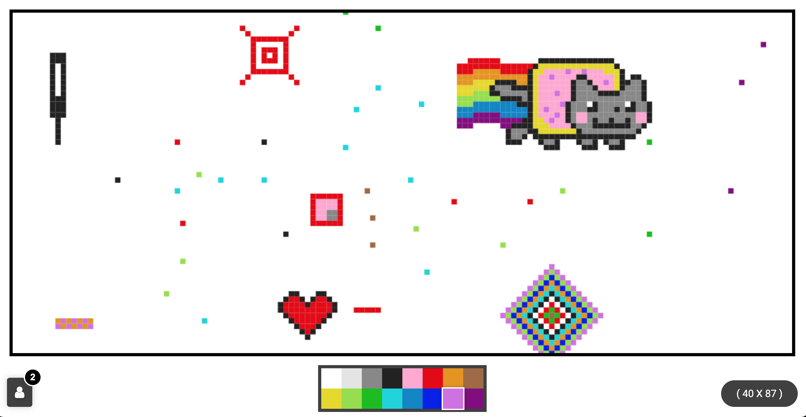

# Pixel Art

A canvas for drawing pixels in real-time



## Features
* Panning and Zooming of canvas
* Realtime update


## Used technologies
* [Aiohttp](https://github.com/aio-libs/aiohttp)
* [Scroller](https://github.com/pbakaus/scroller)

## Inspired by
* [place](https://www.reddit.com/r/place/)
* [PixelCanvas](https://pixelcanvas.io/)

## Running locally

Since logic of front is written on plain static Javascript, there is one line change that needs to be done

Change `url` in `front/static/script.js` to `ws://0.0.0.0:8080`

Then run
```
docker-compose up
```
